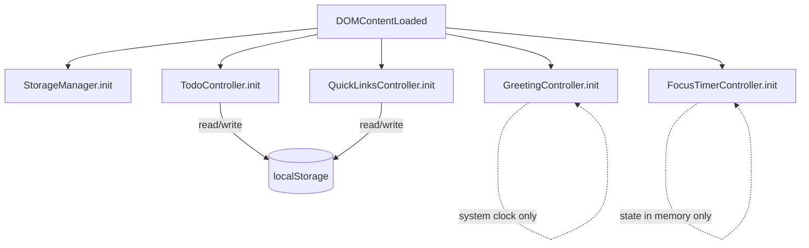

# Design Document — Todo List Dashboard

## Overview

The Todo List Dashboard is a **single-page web application** built exclusively with HTML, CSS, and Vanilla JavaScript. It runs entirely in the browser — no build toolchain, no server, no external dependencies. All state is stored in `localStorage`.

The app is structured as one HTML file (`index.html`) that loads one stylesheet (`css/style.css`) and one JavaScript module (`js/app.js`). The four visible components — Greeting Section, Focus Timer, Todo List, and Quick Links — are rendered once at page load and updated in-place by direct DOM manipulation.

### Goals

- Zero-install: open `index.html` directly in a browser or serve it as a new-tab extension page.
- Resilient: gracefully handles `localStorage` failures, missing system clock, and malformed stored data.
- Accessible and readable: semantic HTML, clear focus management, responsive layout.

---

## Architecture

### File Structure

```
index.html          — single HTML page; defines markup skeleton
css/
  style.css         — all visual styles, including responsive layout
js/
  app.js            — entire application logic
```

### Module Organisation inside `app.js`

`app.js` uses an **IIFE (Immediately Invoked Function Expression)** pattern to avoid polluting the global scope. Internally, the code is divided into clearly separated logical sections that mirror the four requirements areas plus shared infrastructure:

```
app.js
├── StorageManager        — read/write localStorage; serialise/deserialise JSON
├── GreetingController    — live clock, date display, time-based greeting
├── FocusTimerController  — countdown logic, Start/Stop/Reset, drift correction
├── TodoController        — add/edit/delete/complete tasks, inline validation
└── QuickLinksController  — add/delete links, URL normalisation, tab navigation
```

Each controller is an object literal with an `init()` function called at `DOMContentLoaded`. Controllers communicate only through the shared `StorageManager`; they do not hold references to each other.



### Rendering Strategy

All four controllers follow the same render cycle:

1. **Read** — load current state (from `localStorage` or in-memory).
2. **Mutate** — apply user action to state.
3. **Persist** — call `StorageManager` to write updated state.
4. **Render** — rebuild the relevant DOM subtree from state.

This unidirectional flow keeps the DOM and state in sync without a virtual DOM or reactive framework.

---

## Components and Interfaces

### 1. HTML Structure

```html
<body>
  <main class="dashboard">

    <!-- Component 1 -->
    <section id="greeting" class="card">
      <p id="greeting-message"></p>   <!-- "Good Morning" etc. -->
      <time id="greeting-time"></time>
      <p id="greeting-date"></p>
    </section>

    <!-- Component 2 -->
    <section id="focus-timer" class="card">
      <output id="timer-display">25:00</output>
      <div class="timer-controls">
        <button id="timer-start">Start</button>
        <button id="timer-stop" hidden>Stop</button>
        <button id="timer-reset">Reset</button>
      </div>
      <div id="timer-alert" hidden aria-live="assertive"></div>
    </section>

    <!-- Component 3 -->
    <section id="todo-list" class="card">
      <form id="todo-add-form">
        <input id="todo-input" type="text" maxlength="500"
               placeholder="Add a task…" autocomplete="off" />
        <button type="submit">Add</button>
        <p id="todo-add-error" class="error" hidden></p>
      </form>
      <ul id="todo-items" aria-live="polite"></ul>
    </section>

    <!-- Component 4 -->
    <section id="quick-links" class="card">
      <form id="links-add-form">
        <input id="link-label-input" type="text" maxlength="50"
               placeholder="Label" />
        <input id="link-url-input" type="url" maxlength="2048"
               placeholder="https://…" />
        <button id="links-add-btn" type="submit">Add</button>
        <p id="links-add-error" class="error" hidden></p>
      </form>
      <p id="links-limit-msg" hidden>Maximum 20 links reached.</p>
      <ul id="links-list"></ul>
    </section>

  </main>
</body>
```

### 2. CSS Approach

`style.css` uses **CSS custom properties** (variables) for the colour palette and spacing scale, making theme changes easy. Layout is implemented with **CSS Grid** at the dashboard level and **Flexbox** inside each card.

```css
/* Responsive breakpoint */
.dashboard {
  display: grid;
  grid-template-columns: 1fr;          /* single column < 768px */
  gap: var(--space-lg);                /* ≥ 16px */
}

@media (min-width: 768px) {
  .dashboard {
    grid-template-columns: 1fr 1fr;    /* two columns ≥ 768px */
  }
}
```

Typography baseline: `body { font-size: 16px; line-height: 1.5; }` — satisfies the ≥14px / ≥1.4 requirement with comfortable headroom.

Each `.card` gets `padding`, `border-radius`, and a subtle `box-shadow` to provide clear visual separation between components.

Strikethrough for completed tasks: `.task--done .task-title { text-decoration: line-through; }`.

### 3. GreetingController

**Responsibilities**: display time, date, greeting message; update every 60 seconds.

```js
const GreetingController = {
  _intervalId: null,

  init() {
    this._render();
    this._intervalId = setInterval(() => this._render(), 60_000);
  },

  _render() {
    const now = new Date();
    // time — delegates to browser locale for 12h/24h
    timeEl.textContent = now.toLocaleTimeString([], { hour: '2-digit', minute: '2-digit' });
    // date — full weekday, day, month, year
    dateEl.textContent = now.toLocaleDateString([], {
      weekday: 'long', day: 'numeric', month: 'long', year: 'numeric'
    });
    // greeting
    greetingEl.textContent = this._greetingFor(now.getHours());
  },

  _greetingFor(hour) {
    if (hour >= 5  && hour < 12) return 'Good Morning';
    if (hour >= 12 && hour < 18) return 'Good Afternoon';
    if (hour >= 18 && hour < 21) return 'Good Evening';
    return 'Good Night';  // 21–04
  }
};
```

**Clock unavailability**: if `new Date()` throws or returns `Invalid Date`, the render function catches the error and sets the placeholder text `"-- : --"` / `"Date unavailable"` in the relevant elements.

### 4. FocusTimerController

**Responsibilities**: countdown, Start/Stop/Reset, drift correction, visual alert.

State held in memory (timer state does not persist across page reloads by design):

```js
const FocusTimerController = {
  _remaining: 25 * 60,   // seconds
  _startedAt: null,      // wall-clock timestamp when last started
  _snapshotAt: null,     // remaining seconds at last start/resume
  _intervalId: null,
  _running: false,
  // …
};
```

**Drift correction** (Requirement 3.7 / 4.3): rather than decrementing a counter, the controller calculates remaining time from the wall clock:

```js
_tick() {
  const elapsed = Math.round((Date.now() - this._startedAt) / 1000);
  this._remaining = Math.max(0, this._snapshotAt - elapsed);
  this._renderDisplay();
  if (this._remaining === 0) this._onComplete();
}
```

This means the display is always derived from wall-clock elapsed time, so drift is structurally impossible beyond one tick interval (≤1 second).

**Visual alert**: on completion, `timer-alert` is un-hidden with a message and `aria-live="assertive"` ensures screen readers announce it. It auto-hides after 5 seconds (satisfies the ≥3 second requirement).

### 5. TodoController

**Responsibilities**: CRUD operations on tasks, inline validation, delegation of persistence.

```js
const TodoController = {
  _tasks: [],      // Array<Task>
  _editingId: null,

  init() {
    this._tasks = StorageManager.loadTasks();
    this._render();
    // attach submit handler on add form
  },

  _addTask(description) { /* trim, validate, push, persist, render */ },
  _editTask(id, description) { /* validate, update, persist, render */ },
  _toggleTask(id) { /* flip done, persist, render */ },
  _deleteTask(id) { /* filter, persist, render */ },
  _render() { /* rebuild #todo-items ul from this._tasks */ },
};
```

**Edit-mode lock**: `_editingId` tracks which task (if any) is in edit mode. While non-null, all other Edit controls are disabled and new-add is blocked.

**Inline error messages**: validation errors are shown in `<p class="error">` elements adjacent to the relevant input. They are cleared on the next successful submission.

### 6. QuickLinksController

**Responsibilities**: add/delete links, URL normalisation, open in new tab.

```js
const QuickLinksController = {
  _links: [],      // Array<Link>

  init() {
    this._links = StorageManager.loadLinks();
    this._render();
  },

  _addLink(label, url) { /* normalise URL, validate, push, persist, render */ },
  _deleteLink(id) { /* confirm, filter, persist, render */ },
  _openLink(url) { window.open(url, '_blank', 'noopener,noreferrer'); },
  _render() { /* rebuild #links-list ul; toggle add btn disabled if ≥20 */ },
};
```

**URL normalisation**: if the URL does not start with `http://` or `https://`, prepend `https://`. Validation then checks that the result passes `URL` constructor without throwing.

**Confirmation prompt**: deletion uses `window.confirm()` for the confirmation dialog (simple, zero-dependency, cross-browser). This can be replaced with a custom modal in a future iteration.

### 7. StorageManager

**Responsibilities**: abstract all `localStorage` interaction; serialise/deserialise JSON; handle errors.

```js
const StorageManager = {
  TASKS_KEY: 'tdl__tasks',
  LINKS_KEY: 'tdl__links',

  loadTasks() {
    return this._load(this.TASKS_KEY, []);
  },
  saveTasks(tasks) {
    return this._save(this.TASKS_KEY, tasks);
  },
  loadLinks() {
    return this._load(this.LINKS_KEY, []);
  },
  saveLinks(links) {
    return this._save(this.LINKS_KEY, links);
  },

  _load(key, fallback) {
    try {
      const raw = localStorage.getItem(key);
      if (raw === null) return fallback;
      const parsed = JSON.parse(raw);
      return Array.isArray(parsed) ? parsed : fallback;
    } catch {
      return fallback;   // malformed JSON or localStorage unavailable
    }
  },

  _save(key, value) {
    try {
      localStorage.setItem(key, JSON.stringify(value));
      return true;
    } catch {
      return false;      // quota exceeded or storage unavailable
    }
  },
};
```

`_save` returns a boolean so callers can detect failure and show an error message without needing to know the storage internals.

---

## Data Models

### Task Object

```js
/**
 * @typedef {Object} Task
 * @property {string}  id          — UUID v4, generated at creation time
 * @property {string}  description — trimmed, 1–500 characters
 * @property {boolean} done        — false at creation; toggled by completion control
 * @property {number}  createdAt   — Unix timestamp (ms) for stable ordering
 */
```

**Example**:
```json
{
  "id": "f47ac10b-58cc-4372-a567-0e02b2c3d479",
  "description": "Write unit tests for StorageManager",
  "done": false,
  "createdAt": 1725670800000
}
```

**localStorage key**: `"tdl__tasks"`  
**localStorage value**: JSON array of Task objects, ordered by insertion order (append-only; deletions shift remaining items down).

### Link Object

```js
/**
 * @typedef {Object} Link
 * @property {string} id    — UUID v4, generated at creation time
 * @property {string} label — trimmed, 1–50 characters
 * @property {string} url   — normalised URL string beginning with http:// or https://
 * @property {number} order — integer index reflecting display order (0-based)
 */
```

**Example**:
```json
{
  "id": "3fa85f64-5717-4562-b3fc-2c963f66afa6",
  "label": "MDN Docs",
  "url": "https://developer.mozilla.org",
  "order": 0
}
```

**localStorage key**: `"tdl__links"`  
**localStorage value**: JSON array of Link objects, ordered by `order` field ascending.

### localStorage Key Summary

| Key | Contains | Controller |
|---|---|---|
| `tdl__tasks` | `Task[]` | TodoController |
| `tdl__links` | `Link[]` | QuickLinksController |

No other keys are written. The `tdl__` prefix namespaces the app to avoid collisions with other pages sharing the same origin.

### UUID Generation

UUIDs are generated using `crypto.randomUUID()` (supported in all Modern_Browsers as of 2022). A fallback using `Math.random()` is provided for environments that do not support it:

```js
function generateId() {
  if (typeof crypto !== 'undefined' && crypto.randomUUID) {
    return crypto.randomUUID();
  }
  // fallback: pseudo-random hex string
  return 'xxxxxxxx-xxxx-4xxx-yxxx-xxxxxxxxxxxx'.replace(/[xy]/g, c => {
    const r = Math.random() * 16 | 0;
    return (c === 'x' ? r : (r & 0x3 | 0x8)).toString(16);
  });
}
```

---

## Correctness Properties

*A property is a characteristic or behavior that should hold true across all valid executions of a system — essentially, a formal statement about what the system should do. Properties serve as the bridge between human-readable specifications and machine-verifiable correctness guarantees.*

### Property 1: Task serialisation round-trip

*For any* valid array of Task objects, serialising the collection to JSON and then deserialising it SHALL produce an array where each Task has identical `id`, `description`, `done`, and `createdAt` values to the corresponding Task in the original array.

**Validates: Requirements 9.3, 9.4**

---

### Property 2: Link serialisation round-trip

*For any* valid array of Link objects containing between 0 and 20 entries, serialising the collection to JSON and then deserialising it SHALL produce an array where each Link has identical `id`, `label`, `url`, and `order` values to the corresponding Link in the original array.

**Validates: Requirements 13.3, 13.4**

---

### Property 3: Whitespace-only task descriptions are rejected

*For any* string composed entirely of whitespace characters (spaces, tabs, newlines), submitting it as a task description SHALL leave the task list unchanged and SHALL display an inline error message.

**Validates: Requirements 5.5**

---

### Property 4: Whitespace-only edit values are rejected

*For any* existing Task and any string composed entirely of whitespace characters, confirming an edit with that string SHALL leave the task's description unchanged, keep the Task in edit mode, and display an inline error.

**Validates: Requirements 6.6**

---

### Property 5: Task addition grows the list by exactly one, with trimmed description and done=false

*For any* existing task list and any valid (non-empty, non-whitespace) task description string (potentially with leading or trailing whitespace), adding the task SHALL result in the list length increasing by exactly 1, the new Task appearing at the end with `description` equal to `input.trim()` and `done` equal to `false`, and the input field being cleared.

**Validates: Requirements 5.2, 5.3**

---

### Property 6: Task deletion preserves relative order

*For any* task list of length n ≥ 1 and any valid index i, deleting the Task at position i SHALL produce a list of length n − 1 where all Tasks at positions 0…i−1 and i+1…n−1 remain in their original relative order.

**Validates: Requirements 8.2**

---

### Property 7: Completion toggle is an involution

*For any* Task, toggling its completion state twice SHALL return the Task to its original completion state (i.e., toggle ∘ toggle = identity).

**Validates: Requirements 7.2, 7.3**

---

### Property 8: Time-based greeting covers all 24 hours with no gaps or overlaps

*For any* integer hour h in [0, 23], `_greetingFor(h)` SHALL return exactly one of `"Good Morning"`, `"Good Afternoon"`, `"Good Evening"`, or `"Good Night"`, and the mapping SHALL be consistent with the period boundaries defined in Requirements 2.1–2.4.

**Validates: Requirements 2.1, 2.2, 2.3, 2.4, 2.6**

---

### Property 9: URL normalisation prepends https:// when scheme is absent

*For any* URL string that does not begin with `http://` or `https://`, the normalisation function SHALL prepend `https://` and the result SHALL be a valid URL as verified by the `URL` constructor.

**Validates: Requirements 10.5**

---

### Property 10: Link count never exceeds 20

*For any* sequence of add-link operations starting from an empty collection, the resulting collection size SHALL never exceed 20, and the Add control SHALL be disabled once the limit is reached.

**Validates: Requirements 10.2, 10.6**

---

### Property 11: Timer display format is valid MM:SS for any remaining seconds

*For any* integer number of remaining seconds in the range [0, 1500] (representing 0 to 25 minutes), the timer format function SHALL produce a string that matches the pattern `MM:SS` where MM is a zero-padded two-digit minutes value and SS is a zero-padded two-digit seconds value, and the encoded total seconds equals the input value.

**Validates: Requirements 3.3**

---

## Error Handling

### Strategy: Fail-Safe Defaults

All error conditions produce a **visible user message** and **retain the best available in-memory state**. No error silently swallows state.

| Scenario | Response |
|---|---|
| `localStorage.setItem` throws (quota exceeded) | Show toast/inline error; retain in-memory state for session |
| `localStorage.getItem` returns malformed JSON | Discard; use empty array as default; no error propagated to UI |
| `localStorage` entirely unavailable | `StorageManager._load` returns fallback; `_save` returns `false`; controllers show persistent warning banner |
| `new Date()` returns Invalid Date | Greeting renders `"-- : --"` and `"Date unavailable"` placeholders |
| URL constructor throws on malformed URL | QuickLinksController shows inline error; submission rejected |
| `window.open` blocked by browser | No crash; the blocked-popup browser UI handles user notification |
| Empty task list after last deletion | `_render()` emits a `<p>No tasks yet.</p>` empty-state element |
| Empty links panel | `_render()` emits a `<p>No links yet.</p>` empty-state element |

### Error Message Display

- **Inline errors** (validation): `<p class="error">` adjacent to the offending input. Cleared on next successful submit.
- **Persistence errors**: a dismissible `<div class="toast error">` appended to `<body>`, auto-dismissed after 5 seconds. Uses `aria-live="polite"` so screen readers announce it.

### No Uncaught Exceptions

All async-style operations (timer intervals, `localStorage` access) are wrapped in `try/catch`. The global `window.onerror` handler logs errors to `console.error` without crashing the page.

---

## Testing Strategy

### Dual Testing Approach

The testing strategy uses two complementary layers:

1. **Property-based tests** — verify universal correctness properties across a large input space.
2. **Unit tests** — verify specific scenarios, edge cases, and integration points with concrete examples.

### Property-Based Testing

The feature involves pure logic functions (serialisation, validation, greeting mapping, URL normalisation, list mutation) that are ideal candidates for property-based testing.

**Recommended library**: [fast-check](https://fast-check.io/) for JavaScript.

Each property test runs a **minimum of 100 iterations** with randomly generated inputs. Tests are tagged as follows:

```
// Feature: todo-list-dashboard, Property 1: Task serialisation round-trip
```

| Property | Test focus | Generator inputs |
|---|---|---|
| Property 1 | `StorageManager` JSON round-trip (tasks) | Arbitrary Task arrays |
| Property 2 | `StorageManager` JSON round-trip (links) | Arbitrary Link arrays (0–20 items) |
| Property 3 | Empty/whitespace task rejection | Whitespace-only strings |
| Property 4 | Whitespace edit rejection | Any Task + whitespace string |
| Property 5 | Add grows list by 1, trimmed desc, done=false, input cleared | Any task list + valid description |
| Property 6 | Delete preserves order | Any list ≥1 + valid index |
| Property 7 | Toggle is involution | Any Task |
| Property 8 | Greeting covers all hours | Integer in [0, 23] |
| Property 9 | URL normalisation | URL strings without scheme |
| Property 10 | Link count ≤ 20 | Sequence of add operations |
| Property 11 | Timer display format | Integers in [0, 1500] |

### Unit Tests

Unit tests cover:

- **GreetingController**: specific boundary hours (0, 4, 5, 11, 12, 17, 18, 20, 21, 23) return the correct greeting string.
- **FocusTimerController**: Start from initial state, Stop retains remaining time, Reset restores 25:00, double-Start is a no-op, completion triggers alert.
- **TodoController**: adding a task clears the input field; deleting the last task renders empty state; edit-mode lock prevents concurrent edits.
- **QuickLinksController**: clicking a link calls `window.open` with `_blank`; link with empty URL does not open a tab.
- **StorageManager**: `_load` with `null` stored value returns fallback; `_load` with non-array JSON returns fallback; `_save` failure returns `false`.

### Test Environment

Tests run in **jsdom** (via Jest or Vitest) to simulate the browser DOM and `localStorage` without a real browser. The `localStorage` mock supports simulating quota-exceeded errors and unavailability.

**Suggested run command** (single execution, no watch mode):

```
npx vitest --run
```

or

```
npx jest --no-coverage
```
